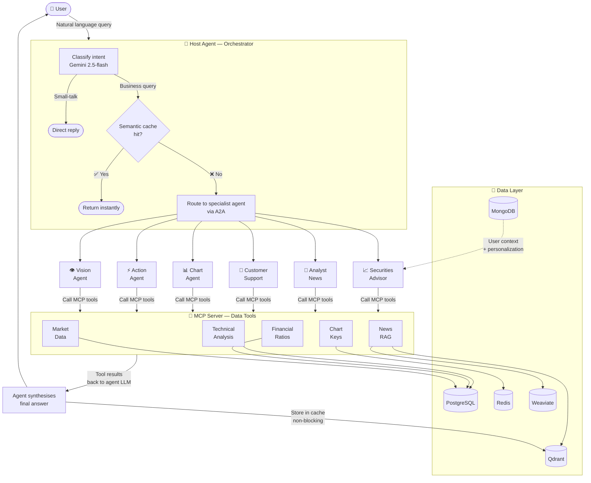
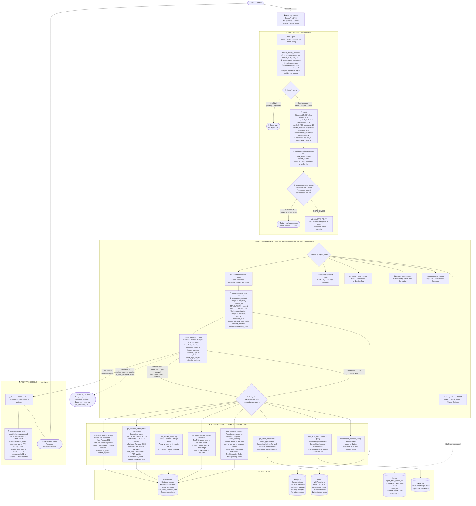
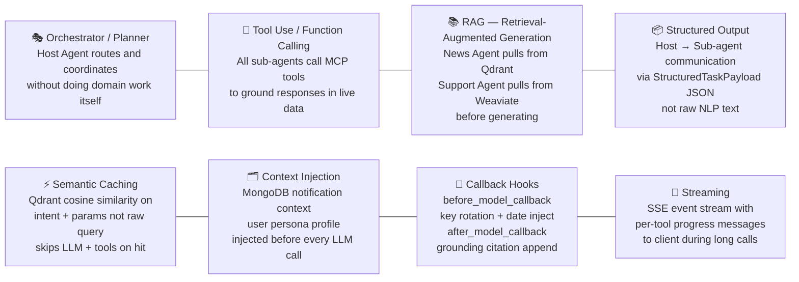
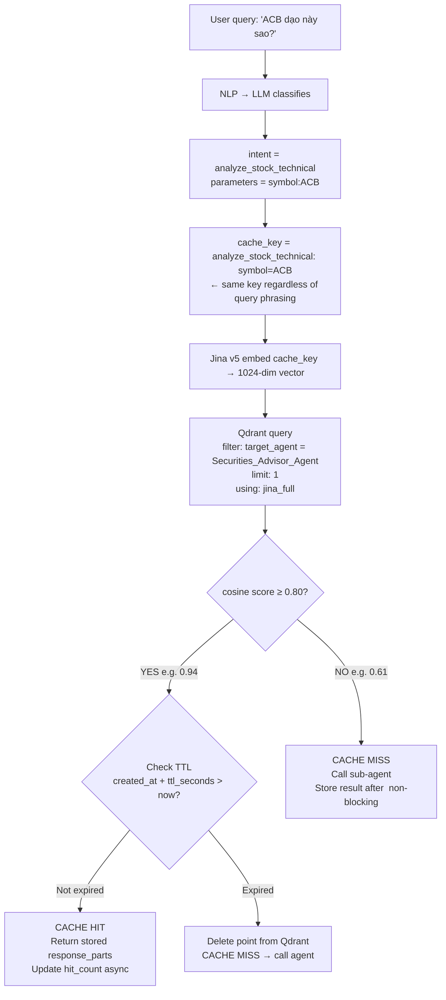

# Agentic AI Design — Flow Diagram

> Agent System: AI Stock & Finance (Leo Activation)

---

## Overview (Simplified)

---

## Full Request Flow

---

## Agentic Patterns Legend

---

## Cache Decision Detail

---

## Detailed Sequence Diagram

> Shows every decision point in order, with exact timing of what triggers what.
> Example query: **"Phân tích kỹ thuật ACB"** routed to Securities Advisor Agent.

```mermaid
sequenceDiagram
    autonumber

    participant U  as 👤 User
    participant APP as 🖥️ Main App :5678
    participant HOST as 🧠 Host Agent
    participant QD  as 🗄️ Qdrant Cache
    participant SA  as 📈 Securities Advisor :10001
    participant MDB as 🍃 MongoDB
    participant MCP as 🔧 MCP Server :8889
    participant PG  as 🐘 PostgreSQL
    participant RD  as ⚡ Redis

    U->>+APP: HTTP POST query="Phân tích kỹ thuật ACB"
    APP->>+HOST: invoke(query, user_id, session_id)

    Note over HOST: ① before_model_callback
    HOST->>HOST: Pick random key from HOST_API_KEY_LIST
    HOST->>HOST: Inject VN date + trading calendar into session state
    HOST->>HOST: Detect holiday / market open status

    Note over HOST: ② LLM Intent Classification — Gemini 2.5-flash
    HOST->>HOST: Prompt = system_prompt_host(dates, holiday, agents)

    alt Small-talk or greeting (e.g. "Xin chào", "Bạn làm được gì?")
        HOST-->>APP: Direct reply — no send_task called
        APP-->>U: 💬 Text response
    else Business query detected
        Note over HOST: ③ Build StructuredTaskPayload
        HOST->>HOST: intent = analyze_stock_technical
        HOST->>HOST: parameters = {symbol: ACB, timeframe: 1D}
        HOST->>HOST: cache_key = "analyze_stock_technical: symbol=ACB timeframe=1D"
        HOST->>HOST: point_id = SHA-256(cache_key)[:32]

        Note over HOST,QD: ④ Semantic Cache Lookup
        HOST->>HOST: Jina v5 embed cache_key → 1024-dim vector
        HOST->>+QD: query(vector, filter=target_agent, limit=1)
        QD-->>-HOST: {score: 0.xx, payload: {...}, created_at, ttl_seconds}

        alt CACHE HIT — score ≥ 0.80
            alt TTL not expired
                HOST->>QD: set_payload(hit_count + 1) [async, non-blocking]
                HOST-->>APP: Cached response_parts
                APP-->>U: ⚡ Response (no LLM or tool calls made)
            else TTL expired
                HOST->>QD: delete(point_id) [cleanup stale entry]
                Note over HOST: Treat as CACHE MISS → continue
            end
        else CACHE MISS — score < 0.80
            Note over HOST,SA: ⑤ A2A Dispatch
            HOST->>+SA: HTTP POST /tasks/send (StructuredTaskPayload JSON)
            Note over SA: Receives: intent, parameters, user_persona,<br/>conversation_summary, metadata

            Note over SA,MDB: ⑥ Context Enrichment (before LLM call)
            SA->>+MDB: find(notification_payload, {notification_id: session_id})
            MDB-->>-SA: System context — market alerts, analyst signals
            SA->>+MDB: find(ai_personalization, {user_info.id: user_id})
            MDB-->>-SA: User profile — expertise_level, tone_style, watchlist

            alt Notification context found
                SA->>SA: Prepend MANDATORY system context to query
                Note right of SA: Agent must NOT contradict this context
            end
            alt Personalization found
                SA->>SA: Inject user profile into prompt
                Note right of SA: Adjust depth, terminology,<br/>tone based on expertise_level
            end

            Note over SA: ⑦ Inject knowledge files into system prompt
            SA->>SA: Load funnel_logic.md → TA indicator mapping
            SA->>SA: Load financial_logic.md → data_group decision rules
            SA->>SA: Load market_logic.md → market tool parameters
            SA->>SA: Load chart_logic_key.md → chart metric reference
            SA->>SA: Load statistic_logic.md → query engine schema

            Note over SA: ⑧ LLM Reasoning Loop — Gemini 2.0-flash
            SA->>SA: Plan which MCP tools to call

            SA->>+MCP: [SSE] technical_analyze("ACB")
            Note right of SA: Streaming update to client:<br/>"Đang xử lý công cụ technical_analyze..."
            MCP->>+PG: SELECT * FROM basement.aip_stock_watchlist_tcbs WHERE ticker='ACB'
            PG-->>-MCP: MA, RSI, MACD, BB, ATR, OBV, ADX, DMI raw values
            MCP->>MCP: Group into trend · momentum · volume · breakout · system_signals
            MCP-->>-SA: Structured TA result dict

            SA->>+MCP: [SSE] get_financial_info("ACB", data_group="profitability")
            Note right of SA: Streaming update:<br/>"Đang xử lý công cụ get_financial_info..."
            MCP->>+PG: SELECT financial statements WHERE ticker='ACB'
            PG-->>-MCP: Income statement, balance sheet, ratios
            MCP->>MCP: Compute ROE · ROA · DuPont 3-factor decomposition
            MCP-->>-SA: Profitability ratios

            opt User also asked for market trend
                SA->>+MCP: [SSE] get_market_summary(symbol="ACB", days=30)
                MCP->>+PG: SELECT historical_quotes WHERE ticker='ACB' LIMIT 30
                PG-->>-MCP: Price · volume · foreign trade series
                MCP-->>-SA: Market summary
            end

            opt User requested a chart
                SA->>+MCP: [SSE] get_chart_key(ticket=["ACB"], chart_type="technical", indicators=[...])
                MCP->>MCP: Compute chart config → keyHash
                MCP->>RD: SET keyHash → chart_config [TTL 30 min]
                RD-->>MCP: OK
                MCP-->>-SA: {keyHash: "abc123..."}
                SA->>RD: push_json_data(keyHash, full_response_data)
            end

            Note over SA: ⑨ LLM synthesises final response
            SA->>SA: Combine all tool results into Vietnamese narrative
            SA->>SA: after_model_callback — append grounding citations if web search used

            SA-->>-HOST: A2A TaskResult {status: COMPLETED, message: {parts: [text]}}

            Note over HOST,QD: ⑩ Background Cache Store (non-blocking)
            par asyncio.create_task — does not block response
                HOST->>HOST: Jina v5 embed cache_key → dense vector
                HOST->>HOST: BM25 embed cache_key → sparse vector
                HOST->>QD: upsert(point_id, {jina_full, mrl_256, bm25}, payload)
                Note right of QD: TTL = 10 min for market/stock intents<br/>Payload stores response_data + response_parts
            and
                HOST-->>APP: Structured JSON response
                APP-->>-U: ✅ Final response
            end
        end
    end
```

---

## TTL Policy

| Intent Category | Examples | TTL |
|----------------|---------|-----|
| Real-time market & stock | `analyze_stock_*`, `get_stock_price`, `get_market_*` | **10 min** |
| Stock comparison | `compare_stocks` | **10 min** |
| Chart rendering | `render_chart` | **30 min** |
| News & macro | `analyze_macro_*`, `analyze_sector_*`, `get_market_overview_news` | **2 h** |
| Company & service info | `get_company_*`, `get_service_*` | **12 h** |
| UI actions & images | `execute_ui_action`, `analyze_image` | **Never cached** |
