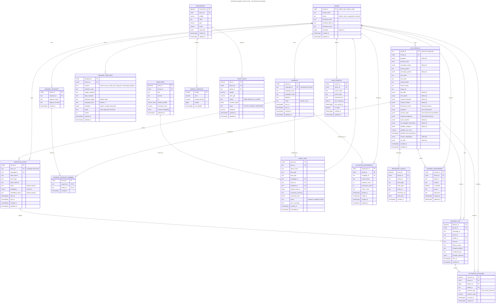

```mermaid
---
title: LEO Data Activation & Alert Center - Full Schema (Corrected)
---
erDiagram

    %% ==========================================
    %% 1. CORE TENANCY (SYSTEM ROOT)
    %% ==========================================
    TENANT {
        UUID tenant_id PK "default: gen_random_uuid()"
        text tenant_name
        text status "default: active | suspended | archived"

        %% Keycloak integration (missing before)
        text keycloak_realm
        text keycloak_client_id
        text keycloak_org_id

        jsonb metadata "default: {}"

        timestamptz created_at
        timestamptz updated_at
    }

    %% ==========================================
    %% 2. CDP PROFILES (CUSTOMER SNAPSHOT)
    %% ==========================================
    CDP_PROFILES {
        text profile_id PK "external / arango key"
        UUID tenant_id FK

        jsonb identities "default: []"
        citext primary_email
        jsonb secondary_emails "default: []"
        text primary_phone
        jsonb secondary_phones "default: []"

        text first_name
        text last_name

        text living_location
        text living_country
        text living_city

        jsonb job_titles "default: []"
        jsonb data_labels "default: []"
        jsonb content_keywords "default: []"
        jsonb media_channels "default: []"

        jsonb behavioral_events "derived summary"
        jsonb segments "array of {id,name}"
        jsonb journey_maps "array of {id,name,funnelIndex}"

        jsonb segment_snapshots "denormalized history"
        jsonb event_statistics "default: {}"
        jsonb top_engaged_touchpoints "default: []"

        jsonb portfolio_snapshot "default: {}"
        numeric portfolio_risk_score
        timestamptz portfolio_last_evaluated_at

        vector interest_embedding "1536 dim"

        jsonb ext_data "default: {}"

        timestamptz created_at
        timestamptz updated_at
    }

    %% ==========================================
    %% 3. STRATEGY & ACTIVATION DEFINITION
    %% ==========================================
    CAMPAIGN {
        UUID tenant_id FK
        text campaign_id PK "composite with tenant"
        text campaign_code
        text campaign_name
        text objective
        text status "default: active"
        timestamptz start_at
        timestamptz end_at
        timestamptz created_at
        timestamptz updated_at
    }

    MARKETING_EVENT {
        UUID tenant_id FK
        text event_id PK "composite with tenant"
        text campaign_id FK

        text event_name
        text event_type
        text event_channel
        text status "default: planned"

        vector embedding "1536 dim"
        text embedding_status "default: pending"

        timestamptz start_at
        timestamptz end_at
        timestamptz created_at
        timestamptz updated_at
    }

    %% ==========================================
    %% 4. MESSAGE TEMPLATES (MISSING BEFORE)
    %% ==========================================
    MESSAGE_TEMPLATES {
        UUID template_id PK
        UUID tenant_id FK

        text channel "email | zalo_oa | web_push | app_push | whatsapp | telegram"
        text template_name

        text subject_template
        text body_template
        text template_engine "default: jinja2"
        text language_code "default: vi"

        jsonb metadata "buttons, images, deep_links"

        text status "draft | approved | archived"
        int version

        timestamptz created_at
        timestamptz updated_at
    }

    %% ==========================================
    %% 5. SEGMENTATION SNAPSHOTS
    %% ==========================================
    SEGMENT_SNAPSHOT {
        UUID tenant_id FK
        text snapshot_id PK
        text segment_name
        text segment_version
        timestamptz created_at
    }

    SEGMENT_SNAPSHOT_MEMBER {
        UUID tenant_id FK
        text snapshot_id PK, FK
        text profile_id PK, FK
        timestamptz created_at
    }

    %% ==========================================
    %% 6. EXECUTION & DECISION
    %% ==========================================
    AGENT_TASK {
        UUID tenant_id FK
        text task_id PK

        text agent_name
        text task_type
        text task_goal

        text campaign_id FK
        text event_id FK
        text snapshot_id FK
        bigint related_news_id FK

        text reasoning_summary
        jsonb reasoning_trace

        text status "pending | completed | failed"
        text error_message

        timestamptz created_at
        timestamptz completed_at
    }

    DELIVERY_LOG {
        bigserial delivery_id PK
        UUID tenant_id FK

        text campaign_id
        text event_id
        text profile_id FK

        text channel
        text delivery_status

        %% missing execution truth fields
        text rendered_subject
        text rendered_body

        jsonb provider_response

        timestamptz sent_at
        timestamptz created_at
    }

    %% ==========================================
    %% 7. ATTRIBUTION & LEARNING (MISSING BEFORE)
    %% ==========================================
    ACTIVATION_OUTCOMES {
        bigserial outcome_id PK
        UUID tenant_id FK

        bigint delivery_id FK
        text profile_id FK

        text outcome_type "click | open | purchase"
        numeric outcome_value

        timestamptz occurred_at
        timestamptz created_at
    }

    ACTIVATION_EXPERIMENTS {
        UUID experiment_id PK
        UUID tenant_id FK
        text campaign_id FK

        text variant_name
        int exposure_count
        int conversion_count
        text metric_name

        timestamptz started_at
        timestamptz ended_at
        timestamptz created_at
        timestamptz updated_at
    }

    %% ==========================================
    %% 8. ALERT & MARKET INTELLIGENCE
    %% ==========================================
    INSTRUMENTS {
        bigserial instrument_id PK
        UUID tenant_id FK
        varchar symbol
        text name
        varchar type
        varchar sector
        jsonb meta_data
        timestamptz created_at
        timestamptz updated_at
    }

    MARKET_SNAPSHOT {
        varchar symbol PK
        numeric price
        numeric change_percent
        bigint volume
        timestamptz last_updated
    }

    ALERT_RULES {
        varchar rule_id PK
        UUID tenant_id FK
        text profile_id FK
        varchar symbol
        varchar alert_type
        text source "USER_MANUAL | AI_AGENT"
        jsonb condition_logic
        text status "ACTIVE | PAUSED | TRIGGERED"
        varchar frequency
        timestamptz created_at
        timestamptz updated_at
    }

    NEWS_FEED {
        bigserial news_id PK
        UUID tenant_id FK
        text title
        text content
        text url
        varchar_array related_symbols
        numeric sentiment_score
        vector content_embedding
        timestamptz published_at
    }

    %% ==========================================
    %% 9. DATA LINEAGE & EVENTS
    %% ==========================================
    DATA_SOURCES {
        UUID source_id PK
        UUID tenant_id FK
        text source_name
        text source_type
        text connection_ref
        interval sync_frequency
        timestamptz last_synced_at
        boolean is_active
        timestamptz created_at
        timestamptz updated_at
    }

    BEHAVIORAL_EVENTS {
        bigserial event_id PK
        UUID tenant_id FK
        text profile_id FK
        text event_type
        text entity_type
        text entity_id
        int sentiment_val
        jsonb meta_data
        timestamptz created_at
    }

    %% ==========================================
    %% 10. CONSENT MANAGEMENT
    %% ==========================================
    CONSENT_MANAGEMENT {
        UUID consent_id PK
        UUID tenant_id FK
        text profile_id FK
        text channel
        boolean is_allowed
        text source
        text legal_basis
        timestamptz created_at
        timestamptz updated_at
    }

    %% ==========================================
    %% RELATIONSHIPS (CORRECTED & COMPLETE)
    %% ==========================================

    TENANT ||--o{ CDP_PROFILES : owns
    TENANT ||--o{ CAMPAIGN : owns
    TENANT ||--o{ MARKETING_EVENT : owns
    TENANT ||--o{ MESSAGE_TEMPLATES : owns
    TENANT ||--o{ SEGMENT_SNAPSHOT : owns
    TENANT ||--o{ AGENT_TASK : runs
    TENANT ||--o{ DELIVERY_LOG : logs
    TENANT ||--o{ ACTIVATION_EXPERIMENTS : measures
    TENANT ||--o{ ACTIVATION_OUTCOMES : attributes
    TENANT ||--o{ DATA_SOURCES : ingests
    TENANT ||--o{ CONSENT_MANAGEMENT : governs

    CDP_PROFILES ||--o{ SEGMENT_SNAPSHOT_MEMBER : included_in
    CDP_PROFILES ||--o{ DELIVERY_LOG : receives
    CDP_PROFILES ||--o{ BEHAVIORAL_EVENTS : generates
    CDP_PROFILES ||--o{ CONSENT_MANAGEMENT : grants
    CDP_PROFILES ||--o{ ACTIVATION_OUTCOMES : produces

    CAMPAIGN ||--o{ MARKETING_EVENT : defines
    CAMPAIGN ||--o{ AGENT_TASK : analyzed_by
    CAMPAIGN ||--o{ ACTIVATION_EXPERIMENTS : experiments_on

    MARKETING_EVENT ||--o{ DELIVERY_LOG : triggers

    SEGMENT_SNAPSHOT ||--o{ SEGMENT_SNAPSHOT_MEMBER : contains

    DELIVERY_LOG ||--o{ ACTIVATION_OUTCOMES : causes

    INSTRUMENTS ||--o{ ALERT_RULES : target_of
    INSTRUMENTS ||--o{ MARKET_SNAPSHOT : updates

    NEWS_FEED ||--o{ AGENT_TASK : context_for

```