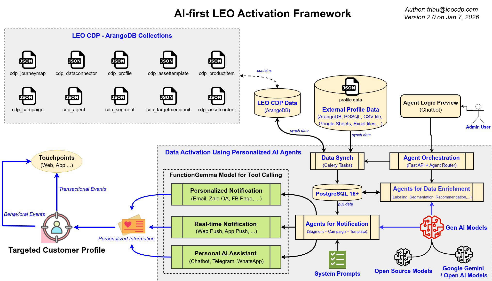
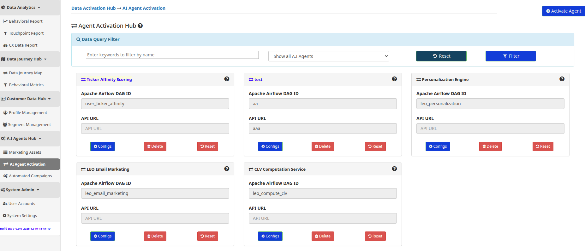
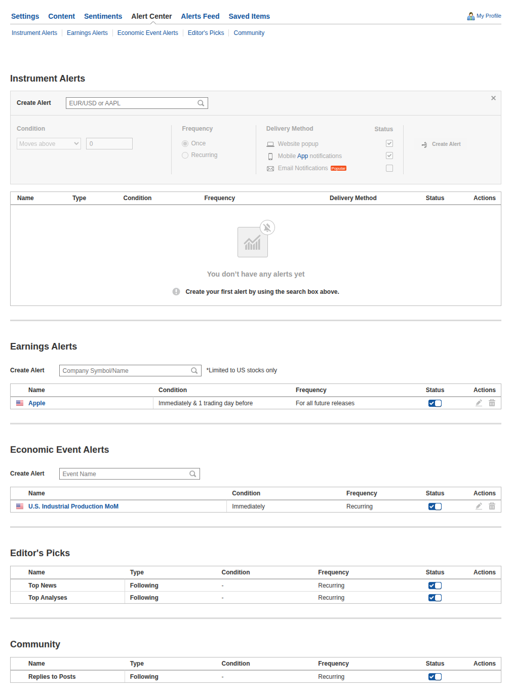

# LEO Activation Platform

## Kế Hoạch Triển Khai

**OKR:** Xây dựng **Activation Engine ứng dụng AI**, khai thác dữ liệu từ CDP  
**Công nghệ cốt lõi:** FastAPI, PostgreSQL 16 (CSDL trung tâm), PGVector, Apache AGE, Celery (xử lý bất đồng bộ)  
**Mô hình AI:**  
- Online: Gemini 2.5 Flash-Lite  
- Offline: FunctionGemma  

**Task Owners:** CDP Product & Engineering  
**Ngày bắt đầu:** 06/01/2026

> **"Code wins arguments. Ship it."**

<!--
Speaker Notes:
Slide mở đầu. Nói rõ đây là POC có deadline cứng.
Không bàn mở rộng scope. Không tranh luận tool.
Mục tiêu duy nhất: ship được hệ activation chạy thật.
-->

---

## Product Vision – LEO Activation

**LEO Activation không phải hệ thống gửi thông báo.**  
Đây là **Decision & Execution Engine**, nằm giữa CDP và các kênh tương tác với **customer / user**.

### Vấn đề hiện tại

- CDP lưu trữ nhiều dữ liệu nhưng **chưa chuyển hoá thành hành động thực tế**
- Thiếu **Campaign & Alert Center** để kích hoạt tương tác đa kênh (Email, Zalo, Web Push,…)
- Chưa có **cơ chế AI điều phối tập trung** cho cá nhân hoá theo từng profile

### Data Activation là module độc lập với CDP, nhằm:

- Chuyển **dữ liệu → quyết định → hành động** theo đúng ngữ cảnh và thời điểm
- Cho phép **AI ra quyết định có kiểm soát**, dựa trên rule, kịch bản và template
- Đảm bảo mọi activation đều **traceable – auditable – explainable**

> **Activation không phải là gửi thông báo.**  
> **Activation là chọn đúng hành động, cho đúng người, vào đúng thời điểm.**

<!--
Speaker Notes:
Slide này là để thống nhất tư duy trước khi xem kiến trúc.
LEO Activation không cạnh tranh với tool gửi tin.
Nó cạnh tranh với sự chậm chạp và thủ công trong việc ra quyết định.
Nếu audience chỉ nhớ 1 điều:
Activation = decision system, không phải messaging system.
-->

---

## Bức tranh tổng thể về Flow

1. **Ingest (Thu thập):** Đồng bộ dữ liệu từ LEO CDP (ArangoDB) → Postgres.
2. **Think (Tư duy):** FunctionGemma phân tích Profile + Context → Quyết định "Làm gì".
3. **Target (Nhắm mục tiêu):** Snapshot Segment (bất biến).
4. **Act (Hành động):** Dispatch tới các kênh (Chat, Zalo, Facebook, Email, Web Push, App Push).

<!--
Speaker Notes:
Slide này để mọi người cùng nhìn một bản đồ.
Không đi chi tiết kỹ thuật.
Chỉ cần hiểu activation là một luồng xuyên suốt, không phải 1 service lẻ.
-->

---

## Timeline 

- **Phase 1: Nền tảng**
- **Phase 2: AI Agents**
- **Phase 3: Activation Engine**
- **Phase 4: Alert Center**
- **Phase 5: Deploy, Fix bugs**

<!--
Speaker Notes:
Timeline này khóa cứng.
Không có chuyện “làm song song cho nhanh” nếu chưa xong phase dưới.
-->

---

# Phase 1: Nền tảng (Ngày 1-4)

## Mục tiêu: Cấu trúc database chuẩn, đầy đủ và tin cậy để scale.

<!--
Speaker Notes:
Phase này là nền tảng dữ liệu database cho quyết định toàn bộ hệ thống.
Nếu nền sai, AI phía trên chỉ là diễn.
-->

---

## [LEO Activation – 01] Khởi tạo Database & Extensions

**WHY – Vì sao task này tồn tại?**  
LEO Activation là hệ thống **AI-first Marketing Automation** để ghi nhận sự thật khi tương tác với user.
Nếu schema sai, mọi quyết định AI phía trên đều sai nhưng không ai biết.

**Mô tả:**  
Khởi tạo PostgreSQL 16 với schema production đã cung cấp. Đảm bảo kích hoạt đầy đủ extensions (`vector`, `pgcrypto`).

**Technical Tasks:**

1. Chạy `schema.sql` với Postgres 16+ instance.
2. Kiểm tra Partitioning trên bảng `marketing_event`.
3. Kiểm tra RLS (Row Level Security).

**Definition of Done (DoD):**

- [ ] `\d marketing_event` hiển thị đủ 16 partitions.
- [ ] Insert vào `cdp_profiles` chỉ thành công khi có `tenant_id` hợp lệ.
- [ ] Trigger `update_timestamp()` hoạt động đúng.

<!--
Speaker Notes:
Partition và RLS là hai thứ không sửa muộn được.
Làm đúng ngay từ POC thì production mới đỡ đau.
-->

---

## [LEO Activation – 02] Worker Đồng bộ Dữ liệu (ArangoDB → Postgres)

**WHY – Vì sao task này tồn tại?**  
Activation runtime không được phụ thuộc CDP. Mọi quyết định phải chạy trên dữ liệu đã ổn định.

**Mô tả:**  
Xây dựng Celery worker để kéo dữ liệu profile từ LEO CDP ArangoDB và upsert vào bảng `cdp_profiles` của Activation.

**Technical Tasks:**

1. Tạo `SyncProfileWorker`.
2. Map các thuộc tính từ Arango sang Postgres.
3. Xử lý logic `ON CONFLICT (tenant_id, ext_id)`.

**Definition of Done (DoD):**

- [ ] Độ trễ Sync < 200ms cho batch 100 profiles.
- [ ] JSONB query được qua GIN index.
- [ ] Không sinh ra profile trùng lặp.

<!--
Speaker Notes:
Đây là mạch máu.
Sync sai = AI sai = activation sai.
-->

---

## [LEO Activation – 03] Segment Snapshot Engine

**WHY – Vì sao task này tồn tại?**  
Không snapshot thì không audit được. Không audit thì AI không giải thích được.

**Mô tả:**  
Implement logic "segment snapshop". Khi campaign kích hoạt, hệ thống phải ghi lại chính xác ai đang ở trong segment tại thời điểm đó.

**Technical Tasks:**

1. API: `POST /snapshot/create`.
2. Query profiles → insert snapshot → insert members.
3. Kiểm tra trigger `prevent_snapshot_removal`.

**Definition of Done (DoD):**

- [ ] Tạo snapshot cho 10k profiles trong < 2 giây.
- [ ] Cố tình xóa snapshot bị DB reject.
- [ ] `snapshot_id` link đúng với `tenant_id`.

<!--
Speaker Notes:
Snapshot là bằng chứng.
Sau này khách hỏi “vì sao tôi nhận tin”, câu trả lời nằm ở đây.
-->

---

# Phase 2: AI Agents 

## Mục tiêu: 
* Tổ chức các chức năng AI Agent như Extended Data Service
* Xây dựng model Text-to-Function
* Mở rộng CDP dễ dàng 
* Truy vết Quyết định.

  

<!--
Speaker Notes:
AI không chỉ trả lời cho vui.
AI phải ra quyết định có log, có trách nhiệm.
-->

---

## [LEO Activation – 04] FunctionGemma Model Service

**WHY – Vì sao task này tồn tại?**  
Marketing không viết code. AI phải dịch ngôn ngữ tự nhiên thành hành động có cấu trúc trong Python.

**Mô tả:**  
Deploy FunctionGemma model (qua API wrapper) để dịch **intent marketing signals** thành các function call có cấu trúc.
Đọc kỹ technical notes https://blog.google/innovation-and-ai/technology/developers-tools/functiongemma/

**Technical Tasks:**

1. Setup LLM Gateway.
2. Định nghĩa Tools/Functions Schema.
3. Implement Prompt Template sử dụng context từ `cdp_profiles`.

**Definition of Done (DoD):**

- [ ] Text → JSON Function Call đúng cú pháp.
- [ ] Latency < 2s.

<!--
Speaker Notes:
Không quan tâm AI nói hay.
Chỉ quan tâm AI gọi đúng hàm.
-->

---

## [LEO Activation – 05] Agent Task Orchestrator

**WHY – Vì sao task này tồn tại?**  
AI không lifecycle, trạng thái và trace thì trở thành hộp đen — không debug, không audit, không kiểm soát được.

**Mô tả:**  
Vòng lặp cốt lõi quản lý vòng đời của một tác vụ AI, sử dụng bảng `agent_task`.

**Technical Tasks:**

1. API `POST /activate/agent`.
2. Tạo record `agent_task`.
3. Lưu `reasoning_trace` & `reasoning_summary`.
4. Retry logic.

**Definition of Done (DoD):**

- [ ] Lưu được trace suy luận.
- [ ] Retry tối đa 3 lần.
- [ ] RLS đúng tenant.

<!--
Speaker Notes:
Agent Task là nhật ký suy nghĩ của AI.
Debug AI = đọc bảng này.
-->

---

# Phase 3: Activation Engine 

---

## [LEO Activation – 06] Unified Dispatcher & Delivery Log

**WHY – Vì sao task này tồn tại?**  
Mọi hành động gửi đi đều phải được ghi nhận rõ ràng.  
Nếu không lưu được delivery log trong database, hệ thống sẽ không biết đã gửi gì, gửi cho ai và kết quả ra sao.

**Mô tả:**  
Xây dựng một Dispatcher dùng Celery + Redis Queue để gửi thông báo một cách bất đồng bộ,  
đồng thời lưu đầy đủ trạng thái gửi (delivery log) vào PostgreSQL làm nguồn dữ liệu đáng tin cậy.

**Technical Tasks:**

1. Tạo Dispatcher (Factory Pattern) để gọi đúng channel adapter.
2. Đẩy tác vụ gửi vào Celery Queue (Redis làm broker).
3. Ghi delivery log với `event_id` theo cách hashing vào PostgreSQL **trước và sau** khi gọi API bên ngoài.

**Definition of Done (DoD):**

- [ ] Mỗi lần dispatch đều có bản ghi `delivery_log` được lưu thành công trong PostgreSQL.
- [ ] `delivery_log` chứa đầy đủ trạng thái gửi và phản hồi từ provider.
- [ ] Nếu không ghi được log, send task sẽ bị dừng, không gọi API bên ngoài.

<!--
Speaker Notes:
Dispatcher là nơi “ra tay”, delivery_log là nơi “ghi sổ”.
Không có log trong Postgres thì không có sự thật để tin.
Celery giúp gửi không block, nhưng database mới là nguồn dữ liệu chính.
-->

---

## [LEO Activation – 07] Channel Adapter: Zalo OA & Email

**WHY – Vì sao task này tồn tại?**  
Việt Nam = Zalo + Email. Ở Việt Nam, Zalo và Email vẫn là kênh tiếp cận user phổ biến.

**Mô tả:**  
Implement các connector cụ thể cho thị trường Việt Nam.

**Technical Tasks:**

- Zalo Adapter.
- Email Adapter.
- Chuẩn hóa format số điện thoại (phonenumbers) và check email (email-validator)

**Definition of Done (DoD):**

- [ ] Gửi email thành công
- [ ] Gửi ZNS thành công và Zalo OA thành công cho người đã theo dõi kênh OA
- [ ] Email sai format, số phone rác không crash worker.

<!--
Speaker Notes:
Test cả case xấu nhất.
Channel hay chết vì lỗi sai data do số điện thoại và email .
-->

---

## [LEO Activation – 08] Channel Adapter: Facebook Page

**WHY – Vì sao task này tồn tại?**  
Facebook Page vẫn là kênh customer support và remarketing quan trọng.

**Mô tả:**  
Implement adapter gửi tin nhắn qua Facebook Page API, phục vụ các use case CSKH và campaign remarketing.

**Technical Tasks:**

1. Tích hợp Facebook Page Messaging API.
2. Quản lý Page Access Token (expire / refresh).
3. Mapping `psid` từ `cdp_profiles`.
4. Xử lý lỗi phổ biến: token expired, permission denied, rate limit.

**Definition of Done (DoD):**

- [ ] Gửi message thành công tới Page Inbox.
- [ ] Token hết hạn phải log rõ lỗi, không crash worker.
- [ ] `delivery_log` ghi nhận đầy đủ response từ Meta API.

<!--
Speaker Notes:
FB Page API rất hay chết vì token và permission.
Phải log đủ để phân biệt lỗi hệ hay lỗi Meta.
Không được trộn FB logic chung với Zalo hay Email.
-->

---

## [LEO Activation – 09] Channel Adapter: Web Push & App Push

**WHY**  
Cung cấp kênh realtime để phản hồi ngay sau khi activation được quyết định.

**Mô tả**  
Triển khai Push Notification cho **Web** và **Mobile App** sử dụng **Firebase Cloud Messaging (FCM)**.

**Technical Tasks**
1. Tích hợp Firebase FCM (Web + App)
2. Quản lý device token / subscription theo profile
3. Push message qua Celery async
4. Tách queue riêng cho realtime channels

**DoD**
- [ ] Push được gửi < 1s sau dispatch
- [ ] Token invalid không crash worker
- [ ] Delivery log ghi nhận đầy đủ

<!--
Speaker Notes:
Kênh realtime tạo cảm giác “hệ đang sống”.
Nếu phản hồi chậm, người dùng sẽ nghĩ hệ bị treo hoặc lỗi,
dù logic phía sau vẫn chạy đúng.
-->

---

# 🔔 Phase 4: Alert Center

> **Alert Center = signal detection layer** cho Activation Engine
> Rule-based · Event-based · Channel-aware

 

---

## [LEO Activation – 10] Threshold Alerts

**Scope**
- Score · Event count · KPI

**Design**
- Rule-based · Time window · De-duplication

**Tech**
- Table: `alert_rule`
- Condition: `above | below | delta_%`
- Frequency: `once | recurring`
- Worker → Activation Engine

**DoD**
- [ ] Trigger đúng condition
- [ ] Có `first_trigger_at`, `last_trigger_at`
- [ ] Không trigger trùng

---

## [LEO Activation – 11] Event-based Alerts

**Scope**

* Campaign · Experiment · Snapshot · Model schedule

**Tech**

* `alert_event`
* Trigger: `immediate | before_X`
* Frequency: `one_time | future`
* Scheduler: Cron / Celery Beat

**DoD**

* [ ] Đúng thời điểm
* [ ] Không miss event
* [ ] Enable / disable được

---

## [LEO Activation – 12] Alert Delivery

**Channels**

* Web · App Push · Email · Ops (Slack / Telegram)

**Tech**

* `alert_delivery_setting`
* Alert → channel mapping
* Enforce user + tenant policy
* Log → `delivery_log`

**DoD**

* [ ] ≥1 channel / alert
* [ ] Channel-level toggle
* [ ] Audit + consent-safe

---

## [LEO Activation – 13] End-to-End Traceability

**Mục tiêu**
Đảm bảo truy vết đầy đủ toàn bộ vòng đời activation.

**Phạm vi**
Event ingest → AI decision → dispatch → delivery log

**Kỹ thuật**
- Correlation ID (`event_id`, `agent_task_id`)
- Truy vết bằng SQL
- Database là source of truth

**DoD**
- [ ] 1 câu SQL truy ra toàn bộ luồng event
- [ ] Không có log bị thiếu hoặc orphan
- [ ] Trace đúng theo tenant

<!--
Speaker Notes:
Task này trả lời câu hỏi: “Hệ có giải thích được chính nó không?”
Nếu product owner không trace được 1 case end-to-end, hệ chưa sẵn sàng chạy thật.
-->

---

## [LEO Activation – 14] Deployment

**Scope**
FastAPI · Celery (+Beat) · PostgreSQL 16 · Redis

**Steps**
1. Infra: Postgres16 (`pgvector`, `apache-age`), Redis, env/secrets  
2. DB: apply schema/migrations, verify RLS & indexes  
3. App: install deps, run FastAPI (Uvicorn)  
4. Workers: start Celery workers + Beat  

**DoD**
- [ ] API healthcheck OK  
- [ ] Workers consuming jobs  
- [ ] DB connected, RLS active  
- [ ] Logs & metrics available

---

## [LEO Activation – 15] Load Testing (k6)

**Purpose**
Validate hệ thống chịu tải ở mức POC trước demo.

**Tool**
- Grafana k6

**Scope**
- Activation end-to-end

**Tasks**
1. Viết k6 scenario cho flow chính
2. Simulate ≥ 5,000 profiles / phút
3. Monitor latency, error rate, Celery backlog
4. Capture test results

**DoD**
- [ ] 5,000 profiles/phút ổn định
- [ ] API error rate < 1%
- [ ] Không DB lock, không queue backlog

<!--
Speaker Notes:
Load test không phải để khoe số đẹp.
Nó để chắc rằng demo không sập.
Nếu fail ở đây, phải fix trước khi nói chuyện feature.
-->

---

## [LEO Activation – 16] Technical Documentation

**Purpose**
Chuẩn hoá tài liệu để bàn giao, vận hành và mở rộng POC.

**Scope**
- Architecture (Activation Flow)
- Core APIs
- Database schema

**Tool**
- MkDocs

**Tasks**
1. Viết docs bằng Markdown
2. Document API & Agent/Dispatcher flow
3. Mô tả DB tables chính
4. Build site bằng MkDocs (local/CI)

**DoD**
- [ ] Docs đầy đủ, dễ đọc
- [ ] MkDocs build OK
- [ ] Dev mới đọc hiểu hệ thống

<!--
Speaker Notes:
MkDocs giúp tài liệu sống cùng code.
Không có doc thì mỗi lần onboarding là một lần giải thích lại từ đầu.
Task này để tiết kiệm thời gian cho tương lai.
-->

---

<!-- _class: final-slide -->

## LEO Activation – Task Status (01–08)

| Task ID | Task Name                         | Status  |
| ------: | --------------------------------- | ------- |
|      01 | Database & Extensions             | 🟩 Done |
|      02 | Data Sync Worker (CDP → PG)       | 🟩 Done |
|      03 | Segment Snapshot Engine           | 🟩 Done |
|      04 | FunctionGemma Model Service       | 🟩 Done |
|      05 | Agent Task Orchestrator           | 🟩 Done |
|      06 | Unified Dispatcher & Delivery Log | 🟩 Done |
|      07 | Channel Adapter: Zalo OA & Email  | 🟩 Done |
|      08 | Channel Adapter: Facebook Page    | ⬜ Todo  |

---

<!-- _class: final-slide -->

## LEO Activation – Task Status (09–16)

| Task ID | Task Name                                  | Status         |
| ------: | ------------------------------------------ | -------------- |
|      09 | Channel Adapter: Web Push & App Push (FCM) | ⬜ Todo         |
|      10 | Alert Center – Threshold Alerts            | 🟦 In Progress |
|      11 | Alert Center – Event-based Alerts          | 🟦 In Progress |
|      12 | Alert Center – Alert Delivery              | ⬜ Todo         |
|      13 | End-to-End Traceability                    | 🟦 In Progress |
|      14 | Deployment                                 | ⬜ Todo         |
|      15 | Load Testing (Grafana k6)                  | ⬜ Todo         |
|      16 | Technical Documentation (MkDocs)           | 🟦 In Progress |

---

