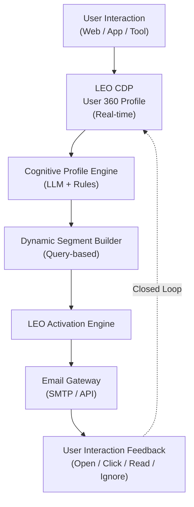

# LEO Activation: Email Newsletter Architecture

**Reference Model: Investopedia (Education-first Financial Engagement)**


---

## 1. Executive Summary

Trong ngành tài chính (Banking, Securities, Trading), **email marketing truyền thống đang chạm trần hiệu quả** vì một nguyên nhân cốt lõi:

> Email bị sử dụng như *kênh bán hàng*, trong khi quyết định tài chính là *quá trình nhận thức*.

Mô hình của **Investopedia** chứng minh một hướng đi khác:

* Không bán trước
* Không dự đoán
* Không kích thích FOMO

Thay vào đó:

* **Financial Literacy**: Giúp người dùng hiểu tài chính một cách bài bản và có hệ thống
* **Cognitive Presence**: Giữ nhịp tương tác nhận thức thay vì tương tác quảng cáo
* **Trust trước Conversion**: Đặt nền móng niềm tin trước mọi hành vi thương mại

**LEO Activation** hiện thực hoá mô hình này bằng cách:

* Gắn chặt với **LEO CDP**
* Dùng AI để hiểu *trình độ – ý định – nhịp học* của từng user
* Xem **Email như một Learning Interface**, không phải campaign blast

---

## 2. System Architecture Overview

### 2.1 CDP → Activation Pipeline



---

### 2.2 Core Architectural Principle

**Separation of Concerns**

| Layer            | Responsibility                            |
| ---------------- | ----------------------------------------- |
| CDP              | Capture facts (events, behavior)          |
| Cognitive Engine | Interpret meaning (knowledge, intent)     |
| Activation       | Decide *when* and *what* to send          |
| LLM              | Generate content within strict governance |

---

## 3. Data Inputs & Entry Points

### 3.1 Event Taxonomy (High-Signal Events)

Không dùng pageview đơn thuần.
LEO chỉ coi **events mang ý nghĩa nhận thức** là input hợp lệ.

| Event                       | Attributes                            | Interpretation      |
| --------------------------- | ------------------------------------- | ------------------- |
| `content_consumed`          | `topic`, `time_spent`, `scroll_depth` | Độ sâu hiểu biết    |
| `glossary_lookup`           | `term`, `difficulty_level`            | Knowledge gap       |
| `chart_interaction`         | `indicator`, `duration`               | Analytical maturity |
| `calculator_used`           | `tool_type`, `input_range`            | Action intent       |
| `newsletter_preference_set` | `topics`, `frequency`                 | Explicit signal     |

---

### 3.2 Cognitive Profile Schema

LEO CDP duy trì **1 profile hợp nhất**, không tách email user riêng lẻ.

```json
{
  "user_id": "u_102938",
  "financial_cognition": {
    "knowledge_level": "Advanced",
    "learning_style": "Systemic",
    "risk_tolerance": "Medium-High",
    "primary_domains": ["Equity", "Macro", "Derivatives"]
  },
  "engagement": {
    "preferred_frequency": "Weekly",
    "best_send_time": "07:30",
    "channel_affinity": {
      "email": 0.91,
      "push": 0.42
    }
  },
  "activation_score": 0.88,
  "last_negative_signal": null
}
```

**Lưu ý kiến trúc:**
Profile này được dùng **đa kênh**, không chỉ email.

---

## 4. Activation Logic: Email as a Learning Unit

### 4.1 Learning Unit Definition

Mỗi email = **1 đơn vị tri thức hoàn chỉnh**, không phải newsletter dài dòng.

**Bắt buộc có 3 lớp:**

1. **Concept Layer**
   Một khái niệm hoặc hiện tượng tài chính duy nhất
2. **Context Layer**
   Ý nghĩa trong bối cảnh hiện tại (market / policy / cycle)
3. **Progression Layer**
   Đường dẫn học tiếp (deep link, tool, analysis)

---

### 4.2 Profile-aware Content Mapping

| Knowledge Level | Content Depth            | Writing Style     |
| --------------- | ------------------------ | ----------------- |
| Beginner        | Definition + Example     | Plain, non-jargon |
| Intermediate    | Relationship & Trade-off | Analytical        |
| Advanced        | Systemic impact & risk   | Concise, abstract |

**Rule:**
Không bao giờ “dạy lại” thứ user đã vượt qua.

---

## 5. Dynamic Segmentation Engine

### 5.1 Segments as Queries, not Lists

Segment trong LEO là **logic**, không phải CSV.

**Example:**

```sql
SELECT user_id
FROM cognitive_profiles
WHERE knowledge_level = 'Beginner'
  AND engagement.preferred_frequency = 'Daily'
  AND activation_score < 0.6
```

---

### 5.2 Standard Segment Archetypes

| Segment          | Purpose                |
| ---------------- | ---------------------- |
| Nurture Track    | Giáo dục nền           |
| Momentum Track   | Duy trì nhịp đọc       |
| Re-activation    | Kéo user quay lại      |
| Conversion-Ready | Gợi ý sản phẩm tinh tế |

---

## 6. LLM Governance & Prompt Design

### 6.1 System Prompt (Hard Constraint)

> You are a financial educator, not a marketer.
> Your responsibility is accuracy, clarity, and neutrality.
> Do not predict prices.
> Do not use emotional persuasion.
> Knowledge precedes action.

---

### 6.2 Tầng Prompt Thích ứng theo Trình độ Người dùng (Adaptive Prompt Layer)

LEO Activation sử dụng **Adaptive Prompt Layer** để điều chỉnh cách LLM sinh nội dung dựa trên **trình độ nhận thức tài chính** của người dùng, thay vì dùng một prompt cố định cho mọi đối tượng.

#### Quy tắc điều chỉnh theo mức độ kiến thức

**Đối với người dùng mức độ Cơ bản (Beginner):**

* Bắt buộc **định nghĩa rõ ràng tất cả thuật ngữ** ngay khi xuất hiện
* Sử dụng **ví dụ cụ thể, quen thuộc**, tránh trừu tượng hoá
* Không giả định người đọc đã có kiến thức nền tài chính

**Đối với người dùng mức độ Nâng cao (Advanced):**

* Giả định người đọc **đã nắm được bối cảnh và thuật ngữ chuyên môn**
* Tập trung phân tích **hệ quả, tác động lan truyền (second-order effects)** và mối liên hệ hệ thống
* Tránh giải thích lại các khái niệm cơ bản đã được người dùng vượt qua

#### Nguyên tắc thiết kế

> Nội dung phải “đi trước một bước”, nhưng không được “nhảy cóc”.
> Mục tiêu là **nâng trình độ nhận thức**, không phải thể hiện độ thông minh của hệ thống.

Tầng prompt này đảm bảo rằng:

* Nội dung luôn phù hợp với mức độ người đọc
* Không gây quá tải nhận thức (cognitive overload)
* Tối ưu hoá quá trình học dài hạn trong các hành trình tài chính phức tạp


---

### 6.3 Chính sách Chống Hallucination & Tuân thủ (Anti-Hallucination Policy)

Để đảm bảo **độ chính xác tài chính**, **an toàn pháp lý** và **uy tín tổ chức**, LEO Activation áp dụng chính sách **Chống Hallucination** nghiêm ngặt ở tầng quản trị LLM.

**Các ràng buộc bắt buộc:**

* **Chỉ cho phép nội dung có căn cứ**
  Mọi phát biểu phải dựa trên dữ liệu nội bộ đã được xác thực, nguồn tri thức được phê duyệt, hoặc ngữ cảnh được cung cấp rõ ràng.
  Bất kỳ nhận định nào không thể kiểm chứng đều **bị loại bỏ**.

* **Cấm cam kết hoặc dự đoán tương lai**
  Hệ thống không được tạo ra dự báo, hứa hẹn, hay ám chỉ kết quả liên quan đến:

  * Giá tài sản
  * Hiệu suất thị trường
  * Lợi nhuận đầu tư

* **Kiểm soát suy đoán**
  Trong trường hợp không có đủ dữ liệu hoặc nguồn hợp lệ, hệ thống phải:

  * Không đưa ra nhận định, hoặc
  * Chỉ mô tả sự kiện/khái niệm ở mức **trung tính – mô tả**, không suy diễn.

**Nguyên tắc thiết kế:**

> Trong truyền thông tài chính, im lặng an toàn hơn sự tự tin không có bằng chứng.

Chính sách này được áp dụng thống nhất cho:

* Sinh nội dung email
* Viết tiêu đề (subject)
* Logic gợi ý CTA và activation

Bất kỳ vi phạm nào cũng sẽ kích hoạt cơ chế:

* Từ chối nội dung, hoặc
* Sinh lại nội dung với ràng buộc nghiêm ngặt hơn.


---

## 7. Metrics & Evaluation Framework

### 7.1 Key Metrics

| Metric                   | Meaning                             |
| ------------------------ | ----------------------------------- |
| Knowledge Retention Rate | User quay lại đọc level cao hơn     |
| Engagement Half-life     | User còn đọc sau N tháng            |
| Time-to-Trust (TTT)      | Từ subscribe → hành động chất lượng |

---

### 7.2 Operational Metrics

* Open Rate (chỉ để health check)
* Topic Affinity Drift
* Negative Signal Rate (unsubscribe, ignore)

---

## 8. Implementation Roadmap

### Phase 1 – Foundation

* Deploy LEO SDK
* Chuẩn hoá event taxonomy

### Phase 2 – Cognitive Baseline

* 14–30 ngày thu thập hành vi
* Gán knowledge level ban đầu

### Phase 3 – Pilot Activation

* 1–2 learning tracks
* No product CTA

### Phase 4 – Scale

* Multi-track
* Cross-channel activation
* Product insight injection (controlled)

---

## 9. PO / Architect Notes

* **Unsubscribe ≠ failure**
  → là negative signal để điều chỉnh cadence & content
* Email template **phải support dynamic blocks**
* CDP & Activation **không được coupling cứng**

---

## 10. Conclusion

Investopedia thành công vì họ hiểu một chân lý đơn giản:

> Trong tài chính, niềm tin không được tạo ra bằng lời chào bán,
mà bằng sự hiểu biết đủ sâu để người ta tự đưa ra quyết định.

LEO Activation biến email thành:

* Hạ tầng tri thức tài chính uy tín
* Công cụ xây niềm tin cho branding
* Bước đệm cho mọi activation đa kênh (App Push, Zalo OA, Facebook Messenger, Telegram,..) sau này
