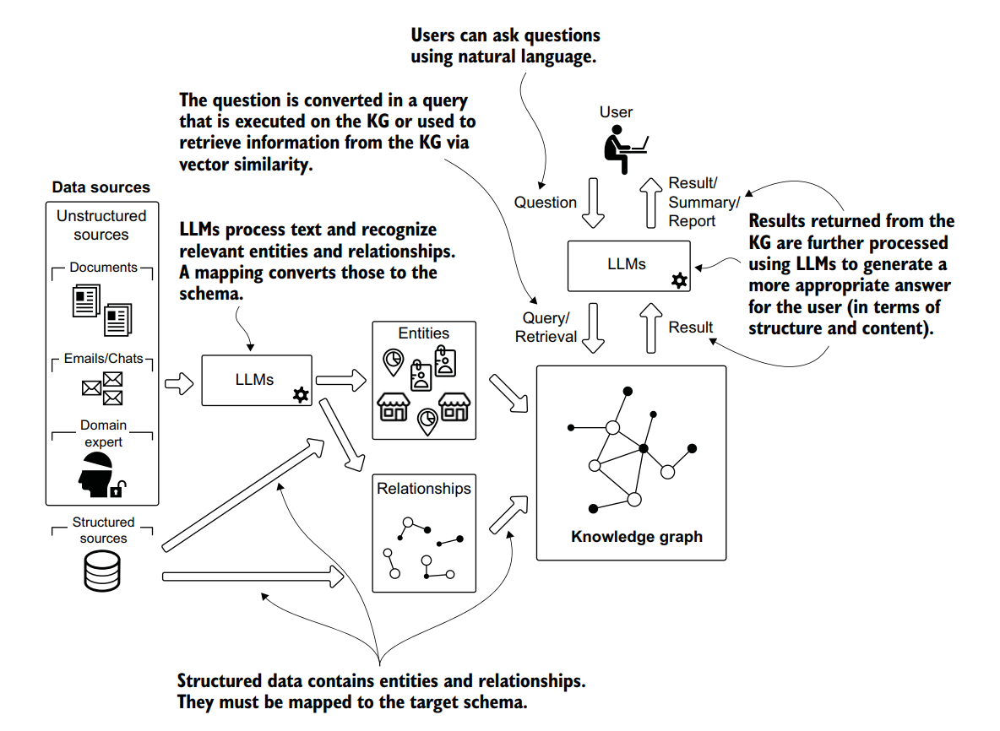

# Knowledge Graph Architecture with PostgreSQL 16, pgvector, Apache AGE, and FastAPI

## 1. Why Knowledge Graph (KG)?



Modern systems fail not because of missing data, but because **data is disconnected**.

Relational databases answer:

> “What rows match this condition?”

Knowledge Graphs answer:

> “How are things related, and why does that matter *now*?”

A Knowledge Graph (KG) represents **entities** (things that exist) and **relationships** (how they interact), forming a network that mirrors real-world structure.

### Why KG matters now

Traditional systems break down when:

* User intent is fuzzy
* Context matters more than exact keywords
* Relationships evolve over time
* Reasoning is more important than aggregation

KGs solve this by:

* Making relationships first-class citizens
* Enabling multi-hop reasoning (“A affects B which influences C”)
* Supporting explainability (critical for finance & education)
* Working naturally with AI and LLMs

### KG + Vector ≠ redundancy

This is key:

* **Knowledge Graph** → symbolic truth, structure, causality
* **Vector embeddings** → similarity, semantics, intuition

Together, they form a **hybrid reasoning system**:

* Graph answers *why*
* Vector answers *what feels similar*

---

## 2. What is modeled & use cases by domain

---

### 2.1 Digital Marketing

#### What we model

* Customers / Segments
* Content
* Campaigns
* Products or Topics
* Channels
* Events (click, view, conversion)

#### Typical relationships

* `INTERESTED_IN`
* `ENGAGES`
* `PROMOTES`
* `MENTIONS`
* `TRIGGERS`

#### Use cases

* Personalized content recommendation
* Campaign attribution (what actually caused conversion)
* Audience discovery (similar users, similar interests)
* Trend detection (what is gaining attention, not just clicks)

**Example reasoning**

> Users who engaged with AI content → interested in Tech stocks → reacted strongly to earnings news
> → trigger campaign automatically.

---

### 2.2 Education

#### What we model

* Learners
* Courses
* Topics / Concepts
* Skills
* Assessments
* Learning resources

#### Relationships

* `PREREQUISITE_OF`
* `TEACHES`
* `HAS_SKILL`
* `WEAK_IN`
* `RECOMMENDS`

#### Use cases

* Personalized learning paths
* Skill gap analysis
* Adaptive curriculum sequencing
* Explainable recommendations (“you failed X because Y depends on Z”)

KGs shine here because **learning is inherently relational**.

---

### 2.3 Stock Trading & Investment

This is not price prediction.
This is **behavioral intelligence**.

#### What we model

* Stocks
* Sectors
* Investor segments
* Market events
* Content & campaigns
* Assets (real estate, bonds, funds)

#### Relationships

* `BELONGS_TO`
* `INTERESTED_IN`
* `MENTIONS`
* `AFFECTS`
* `TRIGGERS`
* `OWNS`

#### Use cases

* Stock discovery (similar assets by theme, not ticker)
* Popularity & attention tracking
* Event-driven marketing
* Portfolio diversification insights
* Cross-asset reasoning (stocks ↔ real estate)

---

## 3. Sample JSON test data

### 3.1 Stock Investment (10 stocks)

```json
{
  "stocks": [
    { "code": "FPT", "name": "FPT Corp", "sector": "Technology" },
    { "code": "VNM", "name": "Vinamilk", "sector": "Consumer" },
    { "code": "VCB", "name": "Vietcombank", "sector": "Banking" },
    { "code": "BID", "name": "BIDV", "sector": "Banking" },
    { "code": "MWG", "name": "Mobile World", "sector": "Retail" },
    { "code": "HPG", "name": "Hoa Phat", "sector": "Steel" },
    { "code": "GAS", "name": "PV Gas", "sector": "Energy" },
    { "code": "SSI", "name": "SSI Securities", "sector": "Finance" },
    { "code": "VHM", "name": "Vinhomes", "sector": "Real Estate" },
    { "code": "VIC", "name": "Vingroup", "sector": "Conglomerate" }
  ],
  "investor_segments": [
    "LongTermInvestor",
    "DayTrader",
    "GrowthSeeker",
    "DividendHunter"
  ]
}
```

---

### 3.2 Real Estate Investment

```json
{
  "properties": [
    {
      "id": "APT_Q2_HCM",
      "type": "Apartment",
      "location": "Ho Chi Minh City",
      "price_range": "Medium"
    },
    {
      "id": "LAND_D9_HCM",
      "type": "Land",
      "location": "District 9",
      "price_range": "High"
    }
  ],
  "investor_profiles": [
    {
      "id": "INV_001",
      "strategy": "RentalIncome"
    },
    {
      "id": "INV_002",
      "strategy": "CapitalGain"
    }
  ]
}
```

---

## 4. Implementation with PostgreSQL 16, pgvector, Apache AGE

---

### 4.1 Enable extensions

```sql
CREATE EXTENSION IF NOT EXISTS vector;
CREATE EXTENSION IF NOT EXISTS age;

LOAD 'age';
SET search_path = ag_catalog, public;
```

---

### 4.2 Create graph

```sql
SELECT create_graph('investment_kg');
```

---

### 4.3 Create nodes & relationships (example: stocks)

```sql
SELECT *
FROM cypher('investment_kg', $$
UNWIND [
  {code:'FPT', sector:'Technology'},
  {code:'VNM', sector:'Consumer'},
  {code:'VCB', sector:'Banking'}
] AS s
MERGE (st:Stock {code: s.code})
MERGE (sec:Sector {name: s.sector})
MERGE (st)-[:BELONGS_TO]->(sec)
RETURN st
$$) AS (st agtype);
```

---

### 4.4 Vector embeddings (semantic layer)

```sql
CREATE TABLE asset_embeddings (
  asset_id text PRIMARY KEY,
  embedding vector(5)
);
```

```sql
INSERT INTO asset_embeddings VALUES
('FPT', '[0.91,0.12,0.88,0.44,0.77]'),
('VNM', '[0.22,0.85,0.31,0.66,0.18]');
```

---

### 4.5 Why AGE + pgvector works well

| Layer      | Purpose                                    |
| ---------- | ------------------------------------------ |
| Apache AGE | Graph traversal, reasoning, explainability |
| pgvector   | Similarity search, semantic recall         |
| PostgreSQL | ACID, security, operational simplicity     |

One database. Two reasoning modes.

---

## 5. Integrating with FastAPI


